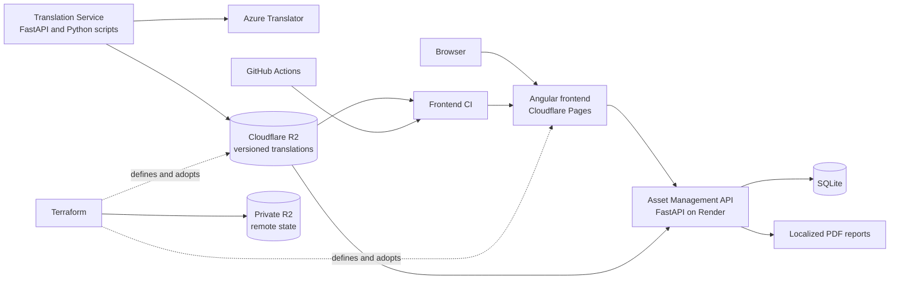

# Cloud-Native Translation Platform

A multilingual asset-management proof of concept with automated translation
publication, localized PDF reports, container validation, cloud deployment, and
infrastructure as code.

The project demonstrates a practical junior Cloud/DevOps workflow: independent
services, reproducible builds, immutable translation artifacts, CI/CD, security
scanning, health checks, and version-controlled Terraform definitions.

## Live application

- Frontend: <https://translation-platform-frontend.pages.dev>
- Asset Management API health: <https://aitranslationsplatformpoc.onrender.com/health>
- API documentation: <https://aitranslationsplatformpoc.onrender.com/docs>

The Render free service can sleep when unused, so the first request may take
longer than normal.

## Architecture



Translation artifacts are published to versioned R2 paths. CI selects an
explicit version, validates it against the source messages, and packages it
into the frontend or backend build. Applications do not download unversioned
translations when they start.

## Components

| Component | Responsibility | Main technology |
| --- | --- | --- |
| `FrontendApp` | Localized user interface in English, French, and German | Angular, TypeScript, nginx |
| `AssetManagementService` | Asset CRUD API and localized PDF generation | FastAPI, SQLAlchemy, Alembic |
| `TranslationService` | Azure translation and versioned R2 publication | FastAPI, Python, boto3 |
| `infrastructure/cloudflare` | Pages and R2 resource definitions | Terraform, Cloudflare provider |
| `.github/workflows` | CI, CD, security, Terraform validation, and uptime checks | GitHub Actions |

## Delivery and operations

| Workflow | Purpose |
| --- | --- |
| Asset Management CI | Tests the API and validates its container |
| Translation Service CI | Runs translation service tests and quality checks |
| Translation Publish | Manually publishes a selected immutable translation version |
| Frontend CI | Tests, audits, localizes, builds, and container-checks the frontend |
| Frontend CD | Deploys the validated frontend artifact to Cloudflare Pages |
| Security CI | Runs Gitleaks, CodeQL, Trivy dependency/configuration scans, and container-image scans |
| Terraform CI | Checks formatting and validates Cloudflare infrastructure code |
| Uptime Monitor | Checks the deployed frontend routes and backend health every six hours |

All credentials are stored in GitHub Actions secrets. Non-sensitive deployment
configuration is stored in GitHub Actions variables. No `.env` file, API token,
or Terraform state is committed.

## Local development

### Asset Management Service

```powershell
cd AssetManagementService
python -m venv .venv
.\.venv\Scripts\Activate.ps1
python -m pip install -r requirements-dev.txt
python -m pytest -q
python -m uvicorn app.main:app --reload
```

### Translation Service

```powershell
cd TranslationService
python -m venv .venv
.\.venv\Scripts\Activate.ps1
python -m pip install -e ".[dev]"
python -m pytest -q
python -m uvicorn app.main:app --reload
```

### Frontend

```powershell
cd FrontendApp
npm ci
npm test -- --watch=false
npm run build:localized
npm start
```

## Cloud configuration

The workflows expect these GitHub Actions variables:

- `AZURE_TRANSLATOR_ENDPOINT`
- `AZURE_TRANSLATOR_REGION`
- `R2_ENDPOINT`
- `R2_BUCKET`
- `R2_TRANSLATION_PREFIX`
- `TRANSLATION_VERSION`
- Optional monitoring overrides: `FRONTEND_URL` and `ASSET_API_URL`

They also expect these GitHub Actions secrets:

- `AZURE_TRANSLATOR_KEY`
- `R2_ACCESS_KEY_ID` and `R2_SECRET_ACCESS_KEY`
- `TRANSLATION_R2_ACCESS_KEY_ID` and `TRANSLATION_R2_SECRET_ACCESS_KEY`
- `CLOUDFLARE_API_TOKEN` and `CLOUDFLARE_ACCOUNT_ID`

Use read-only R2 credentials in consumer workflows and separate write-enabled
credentials only for translation publication.

Terraform backend credentials are intentionally not GitHub Actions secrets.
They are local S3-compatible keys scoped only to the private state bucket.

## Terraform adoption

Terraform definitions are in `infrastructure/cloudflare`. The Pages project and
R2 bucket already exist, so they must be imported before the first plan or
apply. See [the Cloudflare infrastructure guide](infrastructure/cloudflare/README.md)
for the safe commands.

Terraform is deliberately not applied automatically. Pull requests validate
the configuration, while infrastructure changes remain a reviewed manual step.
The encrypted-at-rest state is held in a dedicated private R2 bucket instead of
being committed or shared as a local file.

## Security checks

- **Gitleaks** scans the complete Git history for committed credentials.
- **CodeQL** analyzes security-sensitive data flow in Python and TypeScript.
- **Trivy** blocks high or critical known vulnerabilities in dependencies and
  runtime images, and checks Dockerfiles and Terraform for misconfiguration.
- Containers run as non-root users.

Each tool has a separate responsibility so secret, source-code, dependency,
container, and infrastructure risks are all represented without duplicate
scanning.

## Current scope

This is a portfolio POC, not a production platform. Public API authentication,
managed database hosting, centralized logs, alert routing, remote Terraform
state locking, and multi-environment promotion are sensible future improvements.
The current implementation focuses on a clear, working, zero-cost architecture.
